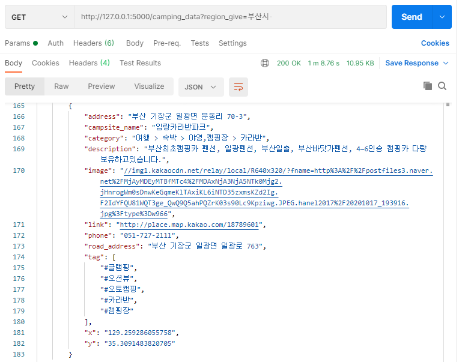

# camping_review

## 데이터베이스 구조 

* 회원
    * 회원번호 (user_no)
    * 아이디 (user_id)
    * 비밀번호 (user_pw)
    * 닉네임 (user_nickname)
    
* 리뷰 게시판
    * 게시글 번호 (review_no)
    * 게시글 제목 (review_title)
    * 등록일자 (review_date)
    * 조회수 (review_hits)
    * 추천수 (review_gets)
    * 회원번호 (review_user_no)
    * 게시글 내용 (review_write)
    
* 코멘트
    * 코멘트 번호 (comment_no)
    * 게시글 번호 (comment_review_no) 
    * 회원번호 (comment_user_no)
    * 등록일자 (comment_date)
    * 코맨트 내용  (comment_write)
  
 
      

  
* 캠핑장
    * 캠핑장 이름 (campsite_name)
    * 캠핑장 분류 (category)
    * 캠핑장 주소 (address)
    * 캠핑장 도로명 주소 (road_address) 
    * 링크 (link)
  